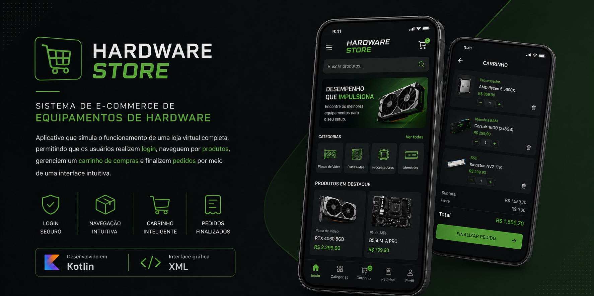

# E-Commerce de Hardware

<p align="center">
  
</p>


---

## Descrição

Este projeto consiste no desenvolvimento de um sistema de e-commerce voltado para a venda de equipamentos de hardware, com foco na simulação de uma loja virtual completa.

O problema abordado é a necessidade de criar uma experiência de compra digital organizada e intuitiva, permitindo que usuários naveguem por produtos, visualizem detalhes e interajam com um sistema de compras. Como solução, foi desenvolvido um site com interface amigável, apresentando produtos, categorias e funcionalidades essenciais de um e-commerce.

O impacto do projeto está na compreensão prática do funcionamento de lojas virtuais, incluindo estrutura de navegação, organização de produtos e experiência do usuário.

---

## Objetivo

* Simular o funcionamento de uma loja virtual
* Praticar desenvolvimento front-end com HTML, CSS e JavaScript
* Trabalhar organização de produtos e layout de e-commerce
* Desenvolver interfaces intuitivas e responsivas
* Aplicar conceitos de interação com o usuário

---

## Tecnologias

* Kotlin
* GitHub

---

## 👀 Preview

<!-- Adicione prints do sistema -->

<!-- Sugestões:
- Página inicial
- Lista de produtos
- Página de detalhes
- Carrinho (se houver) -->

---

## ⚙️ Como executar

```bash
# Clone o repositório
git clone https://github.com/emanuelekm/Hardware_ECommerce.git

# Acesse a pasta
cd Hardware_ECommerce

# Execute abrindo o arquivo index.html
```

---

## Funcionalidades

* Exibição de produtos de hardware
* Interface de loja virtual
* Navegação entre produtos
* Layout organizado por categorias
* Simulação de experiência de compra
* Design visual voltado para e-commerce

---

## Aprendizados

* Estruturação de um sistema de e-commerce
* Organização de layout para lojas virtuais
* Estilização com foco em UX/UI
* Manipulação de elementos com JavaScript
* Boas práticas de desenvolvimento front-end
* Estruturação de projetos para portfólio

---

## Links

* Repositório: https://github.com/emanuelekm/Hardware_ECommerce.git

---

Este projeto possui finalidade acadêmica e pode ser utilizado como base para estudos e evolução de aplicações mobile.
